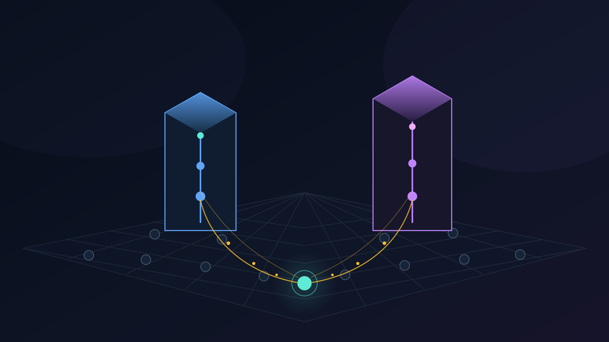
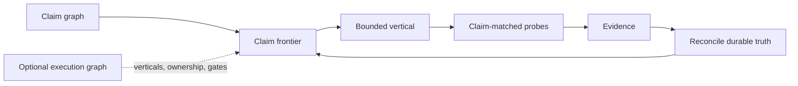

# Graph Climbing

A small, runtime-neutral protocol for long-running agentic engineering.



The runtime is a loop. The work is a graph. Graph Climbing gives an engineering agent wide implementation freedom while tying completion to durable claims and snapshot-bound evidence.

Want the protocol as one copy-paste file? Use the [Graph Climbing Gist](https://gist.github.com/mj-deving/b4060f1188a747caf38d0da5c8a7b332).



```text
derive claim frontier
→ choose one bounded vertical
→ build and falsify
→ reconcile durable truth
→ derive again
```

## Start in sixty seconds

For an existing repository, give [`GRAPH-CLIMBING.md`](GRAPH-CLIMBING.md) to the coding agent and say:

```text
Adopt this protocol using the repository's existing artifacts.
Do not install an orchestration platform.
Report the authority map, claim frontier, frontier kind, active frontier, selected vertical, and first probe before building.
```

An adoption/bootstrap request also persists a concise repository adapter: it updates or creates `AGENTS.md`, and updates `CLAUDE.md` only when that surface is in use. The adapter binds `product_authority`, `operational_ledger`, evidence, resume commands, and stop rules to exact local artifacts while keeping live task state out of first-turn instructions. See [`starter/AGENT-ROUTER.md`](starter/AGENT-ROUTER.md).

For a repository without a durable product specification:

1. Copy [`starter/SPEC.md`](starter/SPEC.md) to the repository root.
2. Give the agent [`starter/START.md`](starter/START.md).
3. From the adopting repository, run `bun /absolute/path/to/graph-climbing/skills/graph-climbing/scripts/graph-check.ts SPEC.md` after the agent fills the claim-first spec.

For a durable `/goal` loop or N parallel workers, give every worker the same compact [`starter/GOAL.md`](starter/GOAL.md) runtime text. It contains no current lane or operator protocol: each worker reconstructs durable state, atomically claims one compatible ready vertical or companion join, reconciles it, and derives again. Release, recovery, and epoch mechanics stay in the graph, ledger, and operator procedure.

When working inside this kit checkout, use `bun run graph-check <path-to-spec>` instead.

The repository also contains an optional [`graph-climbing` skill](skills/graph-climbing/SKILL.md) for bootstrap, audit, and reconciliation. The protocol does not depend on a skill loader.

## Smallest useful stack

```text
one durable spec + existing tests and Git + one agent
```

The durable spec can be `SPEC.md`, an ISA, or another repository-native authority that preserves stable claims, dependencies, falsifying probes, status, decisions, and evidence.

Add an Execution Graph and one operational ledger only when work must survive long runs, external gates, or concurrent writers. Beads, GitHub Issues, and similar trackers can fill the ledger role; none is required.

## Repository contents

- [`GRAPH-CLIMBING.md`](GRAPH-CLIMBING.md): canonical, standalone protocol and copy-paste prompt.
- [`docs/terminology.md`](docs/terminology.md): mechanism-specific terminology and source map.
- [`starter/SPEC.md`](starter/SPEC.md): neutral ISA-inspired specification scaffold.
- [`starter/GOAL.md`](starter/GOAL.md): identical task-free worker contract, kept below common native goal limits; system obligations remain outside the prompt.
- [`starter/AGENT-ROUTER.md`](starter/AGENT-ROUTER.md): non-destructive adoption checklist for repository-native `AGENTS.md`/`CLAUDE.md` mappings.
- [`starter/CLAIM-CHECKLIST.md`](starter/CLAIM-CHECKLIST.md): atomicity and falsification checks.
- [`skills/graph-climbing`](skills/graph-climbing/SKILL.md): optional portable skill.
- `graph-check`: deterministic internal-consistency checker.
- [`examples/notes-cli`](examples/notes-cli/README.md): complete small example.
- [`case-studies`](case-studies/README.md): map of the interim field report, short Autoreview essay, and the two distinct final case studies.
- [`case-studies/dacs-agent-template.md`](case-studies/dacs-agent-template.md): interim Graph Climbing field report from the active DACS Forge build.
- [`case-studies/autoreview-semantic-hardening.md`](case-studies/autoreview-semantic-hardening.md): short reusable account of the inner semantic-hardening loop.
- [`conformance/dogfood/2026-07-21-v2.md`](conformance/dogfood/2026-07-21-v2.md): source-blind V2 scenario and CLI evidence.
- [`conformance/dogfood/2026-07-22-topology-design.md`](conformance/dogfood/2026-07-22-topology-design.md): pre-implementation topology contract plus genuine Fable finding disposition.
- [`conformance/dogfood/2026-07-22-goal-worker-contract.md`](conformance/dogfood/2026-07-22-goal-worker-contract.md): research provenance and source-blind N-worker goal cases.
- [`conformance/fixtures/topology`](conformance/fixtures/topology): executable N=2/3/4 companion-join and failure fixtures.
- [`visuals`](visuals/README.md): deterministic SVG diagrams, 2400×1350 PNG exports, alt text, semantic Mermaid companions, and the editorial hero.

## Visual system

The publication-grade visual set explains the authority stack, layered claim-first execution, one climb with reconciliation and review reopen, and the DACS origin mapping. SVG is the reproducible design source; PNG is the fixed-size publication export; Mermaid is a semantic companion, not the design source. See the [visual index and QA notes](visuals/README.md).

## Check a spec

Requires [Bun](https://bun.sh/). No package dependencies.

```bash
bun run graph-check examples/notes-cli/SPEC.md
bun test
```

`graph-check` verifies mechanical consistency: IDs, dependency references and cycles, probes, evidence requirements, optional vertical-to-claim mappings, current-slice reachability, parallel scope isolation, opt-in `cohort-v1` sealed-lane and N-way companion-join invariants, and derived frontiers. Its report includes `claimFrontier`, `frontierKind`, and the compatible `activeFrontier`. It cannot certify product correctness or semantic claim quality. Named product probes remain the authority for those claims.

## Spec as eval surface

The spec defines the eval surface. Fixtures instantiate it. Evidence decides completion.

Done criteria name the behaviors and failure boundaries that matter. Fixtures, adversarial cases, upstream snapshots, and runtime observations turn those claims into concrete evaluations. Tests and verifiers execute them. A spec without representative cases and falsifying probes is therefore not yet an adequate eval system.

## Adoption boundary

Graph Climbing is not:

- an agent runtime or scheduler;
- a second task tracker;
- a required ISA or Beads installation;
- a hook, daemon, dashboard, or continuous supervisor;
- an automatic completion authority.

The graph is a derived view over durable product truth, optional execution state, and evidence. Guardrails bound product work; they do not become the product.

## Status

Experimental v0.2 reference implementation. The protocol is grounded in one substantial engineering case and bounded source-blind probes, but general productivity claims require more unrelated projects.

## License

MIT
